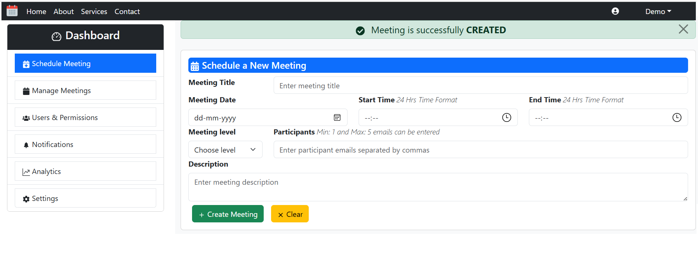

## MEETING CALENDAR FRONTEND APPLICATION Using REACT JS
### Objective:
* Create a Meeting Calendar React Component which focuses more on Schedule & Manage Meetings, Form validation, Apply Routers to Switch between Components and Use Axios to Connect with Spring boot application.
* Follow React best practices to ensure the solution is modular, reusable, scalable, and professional.

### Installed Plugins:
* **`Bootstrap:`** Integrated Bootstrap framework with React for creating responsive and visually appealing react web application.
* **`Validator:`** This plugin used for validating date and time.
* **`React Icons:`** This plugin allows to include only the icons that the project is using.
* **`React Hook form:`** It is a library that simplifies form handling in React with easy field registration, validation, error handling and provides fast performance.
* **`Axios:`** It helps to connect with Backend Java Application for sending request and receiving response.
* **`Routers:`** It helps to efficiently navigate and switch between multiple components in React.

### Meeting Calendar User Interface:
* Meeting Calendar React Component is a frontend react application more focuses on the following features:
    - Implements all the necessary **`CRUD APIs`** functionalities inside Schedule & Manage Meeting components.
    - **`React Hook Form`** validation, error handling and managing user data are also included.
    - Switch across multiple components in Navigation bar and Dashboard using **`Routers`** efficiently.
    - Connect with backend application using **`Axios`** for sending request to them and receiving response from them.

### Components of User Interface:
1. **Navbar:**
    * Contains navigation tabs like Home, About, Services and Contact. At the right end, Place for Icon and Demo tab is provided.
    * **`Navigation Tab:`** It requires details like id, name and navigate url which are provided from the backend through **`Axios`**.
    * **`Demo Tab:`** It is a dropdown require details like id, name, href and navigate url which are provided from the backend through **`Axios`**.
    * Using **`Routers`**, users are able to switch between each navbar component and its own content is rendered.
2. **Dashboard:**
    * Consider this as a parent component and it has 6 child components.
    * Each component in Dashboard requires details like id, name, icon and navigate url which are provided from the backend through **`Axios`**.
    * **`Router`** path for each child component is defined inside this main component. So, it helps to switch between the components. They gets selected during switching.
    * Contains components/tabs like Schedule Meeting, Manage Meetings, Users & Permissions, Notifications, Analytics and Settings.
    * **Child components:**
    1. **`Schedule Meeting:`** It holds 2 child components. Alert Popup component and Meeting Form component used to schedule or update meeting.
        * All the state variables, components(methods) to perform **`Create`** operation and useEffect() methods are declared inside this main component.
        * Whenever any of the child component is rendered, then the state information and operational methods needed for that child component to deliver are sent as **`props`**.
        * **`useEffect():`** Whenever the page is rendered for the very first time or after creation of meeting, then the call request to backend is generated to fetch all the created meetings.
        * **Child components:**
        - 1. **Alert Popup component:** "Meeting is successfully created" message is shown after the appropriate operation.
        - 2. **Meeting Form component:** React Hook form is used behind this form development. It helps to register field, event handling, validate field and throw error when a field does not have value. 
            - **`Form Validation:`**
                i. Form can be submitted only when all the fields are present. Otherwise, this form will throw field wise error.
                ii. Participants - 1 to 5 participants can be entered.
                iii. Past dates are disabled.
                iv. Start time and End time should be in future. End time should be after Start time.
            - **`Form operations:`**
                i. CREATE meeting: After entering all fields in the form, then user can click "Create" button to create the meeting. Call to backend is generated using **`Axios`** to create the meeting. Then Alert popup is shownup with appropriate message.
                ii. CLEAR: If user don't want the entered values and want to reset the field values, then user can click "Clear" button to reset the form fields.
    2. **`Manage Meetings:`** It holds 3 child components. Alert Popup component, Meeting Form component and Meeting List component used to view and modify the created meetings.
        * All the state variables, components(methods) to perform **`Edit or Delete`** operation and useEffect() methods are declared inside this main component.
        * Whenever any of the child component is rendered, then the state information and operational methods needed for that child component to deliver are sent as **`props`**.
        * **`useEffect():`** Whenever the page is rendered for the very first time or after modification of any meeting, then the call request to backend is generated to fetch all the updated version of meetings table.
        * **Child components:**
        - 1. **Alert Popup component:** "Meeting is successfully updated/cancelled" message is shown after the appropriate operation.
        - 2. **Meeting Form component:** React Hook form is used behind this form development. It helps to register field, event handling, validate field and throw error when a field does not have value. 
            - **`Form Validation:`**
                i. Form can be submitted only when all the fields are present. Otherwise, this form will throw field wise error.
                ii. Participants - 1 to 5 participants can be entered.
                iii. Past dates are disabled.
                iv. Start time and End time should be in future. End time should be after Start time.
            - **`Form operations:`**
                i. UPDATE meeting: After doing the necessary modification, then user can click "Update" button to edit the meeting. Call to backend is generated using **`Axios`** to update the meeting. Then Alert popup is shownup with appropriate message.
                ii. CLEAR: If user don't want the entered values and want to reset the field values, then user can click "Clear" button to reset the form fields.
        - 3. **Meeting List component:** Used to display the list of created meetings. In each meeting record, icons for edit and delete is provided.
            - Meeting form component will be hidden initially. But only the Meeting List component is rendered on the UI.
            - On Clicking edit icon, Meeting form component will be visible, all the fields for that record is set inside the form and user can modify it. If user clicks "Update", then call to backend is generated using **`Axios`** to update the meeting. Then Alert popup is shownup with appropriate message. Again, Meeting form component will be hidden and only the Meeting List component is rendered on the UI. If user clicks "Clear", then all the fields are reset to default values.
            - On Clicking delete icon, "Confirm to delete?" popup is shown. If user clicks yes, then the meeting is deleted. If user clicks cancel, the meeting is not deleted.
    3. **`Users & Permissions:`** When user clicks Users & Permissions component, then this component is rendered with appropriate message.
    4. **`Notifications:`** When user clicks Notifications component, then this component is rendered with appropriate message.
    5. **`Analytics:`** When user clicks Analytics component, then this component is rendered with appropriate message.
    6. **`Settings:`** When user clicks Settings component, then this component is rendered with appropriate message.
3. **Footer:** "All Rights Reserved" is included.

### Enhancement:
This Frontend Application can be enhanced to the following features:
* Signup, Signin and Signout feature can be implemented.
* Provide more relevant and appropriate data in Dashboard components like Users & Permissions, Notifications, Analytics and Settings for better enhancement.
* Application can be deployed to Docker.

### Sample UI:
**Schedule Meeting:**

**Manage Meetings:**

